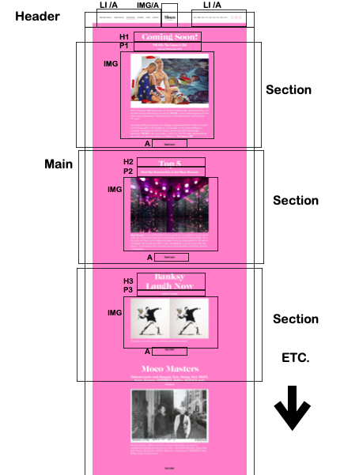

# Procesverslag Front-End
**Gemaakt door:** Esther Willems

## Bronnenlijst
1. Overlay hamburger menu bron:  https://www.w3schools.com/howto/howto_js_fullscreen_overlay.asp
2. Tekst over IMG bron: https://css-tricks.com/text-blocks-over-image/
3. Felxbox extra geheugensteun: https://css-tricks.com/snippets/css/a-guide-to-flexbox/
4. Text transparant met hover: https://www.codegrepper.com/code-examples/html/css+hover+transparent
5. Extra geheugensteun ease in en out: https://css-tricks.com/ease-out-in-ease-in-out/
6. clases en ID’s:  https://www.handleidinghtml.nl/css/selectors/selectors04.html
7. Flexbox, column en row: https://stackoverflow.com/questions/38729285/flexbox-two-elements-on-top-of-each-other-in-flex-direction-row/38745182
8. HTML YouTube video toevoegen:  https://www.w3schools.com/html/html_youtube.asp
9. Cubic bezier: https://stackoverflow.com/questions/25500923/understanding-cubic-bezier-transition-property-in-css
10. Cubic bezier meter: https://cubic-bezier.com/#.42,0,1,1
11. Css animation: https://www.w3schools.com/css/css3_animations.asp
12. Cubic bezier voorbeelden: https://codepen.io/EstherWillems/pen/abmWrpz
13. Css animatie: https://css-tricks.com/making-css-animations-feel-natural/
14. Focus voor slecht ziende: https://codepen.io/EstherWillems/pen/MWjPLoQ
15. Focus voor slechtziende extra: https://css-tricks.com/almanac/selectors/f/focus/
16. Design voorbeeld: https://codepen.io/EstherWillems/pen/dypWEJN
17. Hex kleuren bepalen: https://htmlcolorcodes.com/
18. Linear gradient background: https://css-tricks.com/css-basics-using-multiple-backgrounds/
19. linear gradient background: https://stackoverflow.com/questions/36020521/linear-gradient-doesnt-work-when-applied-to-body
20. Animatie voorbeelden achtergrond: https://codepen.io/search/pens?q=css+animated+gradient+background
21. Streep om letters heen: https://css-tricks.com/adding-stroke-to-web-text/

### De stand van zaken voor het eindgesprek

Ik voel me eigenlijk top. Ik vind het zowaar leuk en ik voel me bijna en code master. Ik heb mij verdiept in de CSS animatie, en heb enorm
veel geleerd. De screenshots doen de animatie's natuurlijk geen goed. Bekijk daarom voorral de website zelf!
De site is ook niet responive. Deze is het beste geopend met bv. chrome, en dan het venster zo klein mogelijk id breedte.
Hier mijn eindwerk, wat ik nooit dacht af te krijgen en waar ik toch wel echt trots op ben :D

**Screenshot(s):**

## Voortgang 3 (week 6)

### Stand van zaken

Ik voel mij een stuk zelfverzekerder. Ik begin steeds meer lol te krijgen en werk goed door. Ik begin nu wel een beetje zicht te verliezen op de belangrijke dingen, niet mieren#*&#^& maar gewoon even doorwerken! Ik voel de kennis wel al zitten, want ik doe er veel minder lang over om
op te starten en te beginnen met het coderen, wat ect wel fijn is.

### Agenda voor meeting

Het groepje, Babs, Kim Dylan en ik.

| student 1:                   | student 2:                             | student 3            | student 4
| Babs                         | Kim                                    | Dylan                | Esther
| Minder CSS regels            | Detailpagina end of type gebruiken     | positionering        | Sections indexpagina klikbaar maken
| Positionering                | crrousel maken of faken                |                      | Tekst niet meeschalen pulsbolletjes
|                              |                                        |                      | Pulsbolletjes zichbaar in uitklap menu

### Verslag van de meeting

De meeting was top, ik kijk uit naar het laatste gesprek. De vragen die ik had waren eigenlijk niet echt nodig. Zoals ik al zelf dacht
kreeg ik de feedback iets meer te focussen op te dingen die er toe doen en niet meer zo in detail te treden. Ook wist ik niet dat ik de site
zelf nog even wat mocht aanpassen in design, leuk! :)
Ik ben er nu ook over uit dat ik de animatie plane verder wil ontwikkelen in mijn site, omdat ik dit toch echt wel het leukste vind om te doen.
De overige belangrijke aantekeningen die ik heb gemaakt:
- Begin nu echt echt echt echt echt echt met de detail pagina!!

## Voortgang 2 (week 5)

### Stand van zaken

Ik zie zeker veel progressie en vooruitgang in mezelf. Nog niet zo veel als dat ik zou willen, maar Rome was ook niet in een dag gebouwd!
De pluspunten vind ik, ik begin het steeds leuker en leuker te vinden, waardoor ik enorm veel tijd besteed aan kennis opdoen
en dingen uitproberen.
Het nadeel, enorm veel tijd dus. Het kost enorm veel tijd om alles in de vingers te krijgen. Ik ben uren bezig met alleen al opstarten
voor dat ik wat van zinvolle code heb weten neet te zetten. So be it.

### Agenda voor meeting

Het groepje, Babs, Kim, Dylan en ik.

| student 1:                   | student 2:                      | student 3            | student 4
| Babs                         | Kim                             | Dylan                | Esther
| How to carrousel maken       | IMG swipen en of klikken        | Icoon rechts zetten  | Hoe krijg hover langzaam
| Hoe minder regels CSS?       | Show menutje                    | responsive           | Tekst niet meeschalen puls rondje
|                              |                                 |                      | slide tekst in footer

### Verslag van de meeting

De meeting ging beter dan verwacht. Ik heb duidelijke feedback ontvangen en ook de vragen die ik had zijn beantwoord.
Ik kan dus weer lekker verder klussen. Ik vind het jammer dat als het grove werk klaar is, de kleine details over blijven. Aan de ene
kant heel chill, maar eenmaal 'vastgelopen' krijg ik het gevoel dat er niet meer tegen op te boksen valt.
De overige belangrijke aantekeningen die ik heb gemaakt:
- Begin nu echt echt echt met de detail pagina!
- Probeer voor jezelf duidelijk te maken of je voor een surface plain gaat of responsiven design AUB.

## Voortgang 1 (week 3)

### Stand van zaken

Ik vond het voor mijn doen goed en tegelijk teleurstellend gaan. Er waren een paar light-bulb momentjes "yaas"
maar ook meerdere IkDoeEr60MinOverOmIetsSimpelsOpTeZoeken momentjes.. Ik heb gemerkt dat veel stof van
vorig jaar zeker is blijven hangen, die heb ik ten beste geprobeerd toe te passen. Ik heb veen energie en tijd
in wat ik tot nu toe kan laten zien gestoken, helaas is het niet helemaal af zoals ik wil (had een stuk verder willen zijn).

**Screenshot(s):**

Helaas is de header nog niet geworden wat ik wil, ik heb wel toegepast wat ik geleerd heb ik de les en daar ben ik als
blauwe piste vertegendoordiger best trots op! (flexbox, positioning en een beetje javascript)

De main vind ik al een stuk beter gelukt, het positioneren ging snel en kan nog beter wanneer ik aan de slag ga met grid (volgende les)
en ik ben blij dat ik de goede afbeeldingen en font heb kunnen inspecteren van de website zelf.
Alle afbeeldingen kloppen, en de font kleuren en grootes ook.

De extra pagina ging vlot, de header moet zoals op de main nog aangepast en verbeterd worden. De pagina bestaat uit 6 expositie
werken, maar zo lang ik een section met een werk uitwerk moet de rest ook lukken.

Het menu vond ik een lastige, ik heb een bron als inspiratie toegepast (even tijdens het feedback rondje vragen in hoeverre ik deze goed heb gebruikt).
Ik hoop tijdens de meeting/feedback ronde meer te leren over of ik op de goede weg ben en hoe ik obstakels aan kan pakken. Misschien hebben mede studenten nog wat tips en tricks die ze zelf hebben gebruikt!

### Agenda voor meeting

Het groepje: Babs, Kim en ik.

| student 1:           | student 2:                                      | student 3    
| Babs                 | Kim                                             | Esther              
| Classes /ID's        | Button ih midden plaatsen                       | Hoe Burger menu maken  / header fixed krijgen  
| HTML terug krijgen   | UL vormgeven | nog een punt | dit wil ik zeker  | IPV flexbox vervangen met Grid?
| Site op niveau?      | Plaatjes van de NAV niet vd site                | LU in NAV onderin   / Alles met de footer

### Verslag van de meeting

De meeting ging goed. Er is duidelijk nog werk aan de winkel maar dit was ook te verwachten! Ik vond het zeer lastig om te werken
zonder classes. Ook het aanroepen van elementen met :nth-of-type etc. is voor mij (en andere) helemaal nieuw! Genoeg zelfstudie
om te doen dus. De basis is een beetje verloren gegaan vorige jaar bij mij, en die moet ik dus zelf (en samen met de docenten ofcourse) weer zien op te bouwen..
De overige belangrijke aantekeningen die ik heb gemaakt:
- Begin echt met de detailpagina!
- Probeer voor jezelf duidelijk te maken of je voor een surface plain gaat of responsiven design.

## Breakdownschets (week 1)

Mijn breakdownschetsen van het Moco museum

De home (index) pagina:  

De Exposities pagina, in twee delen opgesplitst (anders werdt die wel heel lang):

## Intake (week 1)

**Mijn startniveau:**
Mijn startniveau ligt tussen de blauwe en rode piste. Ik vind code lastig, maar het lukt. Doordat ik het niet constant bijhoud
en dus niet verder ontwikkel blijf ik steken. Als iets lukt, kan ik er wel erg van genieten!
**Mijn focus:**
Als eerste keuze ga ik voor extra aandacht voor een surafce plane laag. Het liefste doe ik allebei en maak ik de website dus
ook nog responsive!
**De opdracht:**
De website die ik ga na maken: https://mocomuseum.nl/
**Screenshot(s) van de eerste pagina (small screen):**

**Screenshot(s) van de tweede pagina (small screen):**

